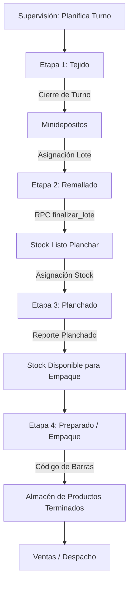

# Guía del Sistema de Producción DUREY

Esta guía contiene la documentación explicativa paso a paso para configurar, administrar y operar el sistema de producción **DUREY** (Flujo: Tejido ➡️ Remallado ➡️ Planchado ➡️ Preparado ➡️ Almacén ➡️ Ventas).

---

## 📌 Capítulo 1: Configuración Inicial e Instalación

Para desplegar el sistema desde cero en un nuevo entorno (local o producción), sigue estos pasos:

### Paso 1: Configurar la Base de Datos (Supabase)
1. Crea un proyecto en [Supabase](https://supabase.com/).
2. Ve al **SQL Editor** de tu panel de Supabase.
3. Ejecuta los archivos de migración ubicados en la carpeta `supabase/migrations/` en orden correlativo (desde `000` hasta `999`).
   > [!IMPORTANT]
   > El script `999_purga_total_sistema.sql` dejará la base de datos vacía y lista para iniciar. Asegúrate de ejecutarlo al final si deseas empezar con datos limpios.

### Paso 2: Configurar las Variables de Entorno
Crea un archivo llamado `.env.local` en la raíz del proyecto `durey-app` con las claves de tu proyecto de Supabase:

```env
NEXT_PUBLIC_SUPABASE_URL=https://tu-proyecto.supabase.co
NEXT_PUBLIC_SUPABASE_ANON_KEY=tu-anon-key-de-supabase
```

> [!TIP]
> **Modo Demo/Local (Mock)**:
> Si el archivo `.env.local` no existe o las claves contienen palabras como `placeholder` o `tu-proyecto`, el sistema entrará automáticamente en **Modo Simulado** (lee y escribe en `mock_db.json` sin requerir conexión a internet).

### Paso 3: Registrar el Administrador Inicial en Supabase Auth
1. Desde el panel de Supabase, ve a **Authentication** ➡️ **Users** ➡️ **Add User** ➡️ **Create User**.
2. Crea el usuario con el correo: `admin@durey.com` y la contraseña que desees.
3. Copia el **User UID** (UUID) que Supabase le asigne automáticamente (ej: `65a2de1b-03f2-4b95-82c2-cc2e3ffc30bb`).
4. Ve al **SQL Editor** y ejecuta la consulta para vincularlo físicamente en la tabla pública de usuarios:
   ```sql
   INSERT INTO public.usuarios (auth_id, nombre, email, rol, activo, estado)
   VALUES ('TU-UUID-COPIADO', 'Administrador Principal', 'admin@durey.com', 'admin', true, 'disponible');
   ```

---

## ⚙️ Capítulo 2: Configuración Maestra del Sistema

Una vez logueado como **Administrador**, el primer paso es cargar las tablas de configuración base antes de iniciar el trabajo de planta.

### 1. Registrar el Catálogo de Productos
1. Navega a **Catálogo**.
2. Registra los modelos de medias de la fábrica. Cada media requiere:
   * **Modelo** (ej: Tobillera, Escolar, Vestir).
   * **Público** (ej: Niño, Caballero, Dama).
   * **Diseño/Color** (ej: Rayas Azules, Blanco liso).
   * **Talla** (ej: S, M, L, Única).
   * **Precio de Venta** por docena.
3. El sistema autogenerará el **SKU** y el **Código de Media** correspondiente para evitar duplicados.

### 2. Registrar el Personal (Usuarios)
1. Navega a **Personal** (Usuarios).
2. Registra a los empleados asignándoles su rol operativo real:
   * **Administrador**: Acceso total a reportes, finanzas, catálogo e incidencias.
   * **Supervisor**: Planifica los turnos de tejido, asigna lotes y supervisa la planta.
   * **Operador**: Registra su propia producción de Tejido, Remallado o Planchado.
   * **Asesora de Ventas** (Vendedora): Registra pedidos, cobros, despachos y caja.
   * **Técnico**: Reporta repuestos y atiende reparaciones de maquinaria.

### 3. Registrar Máquinas
1. Navega a **Maquinas**.
2. Registra las marcas primero (ej: Lonati, Sangiacomo) y luego ingresa cada máquina física en planta asignándole un código identificador único (ej: `TEJ-01`, `REM-02`).

---

## 🔄 Capítulo 3: Flujo de Operación Productiva (Paso a Paso)

El sistema DUREY realiza el control en tiempo real mediante la siguiente secuencia de etapas:



### Etapa 1: Tejido (Producción Inicial)
1. **Supervisor**: Planifica el inicio de la jornada en **Tejido** creando un **Turno de Producción** e indicando qué máquinas y operadoras trabajarán en ese horario.
2. **Operador (Tejedor)**: Inicia sesión, visualiza su máquina asignada y hace clic en **Iniciar Carga de Lote**.
3. **Cierre de Turno**: Al terminar, el tejedor ingresa las docenas físicas tejidas. Al guardar, el recurso se libera (máquina y operador vuelven a estar "disponible") y el stock se acredita de forma automática en los **Minidepósitos**.

### Etapa 2: Remallado (Cierre de Lote Atómico)
1. **Supervisor**: Crea un lote de remallado asignando una cantidad de docenas desde los **Minidepósitos** a una operadora y una máquina remalladora.
2. **Operadora (Remalladora)**: Entra a su módulo de Remallado, inicia el lote de remallado y ejecuta el proceso.
3. **Registrar Producción**: Al finalizar, la operadora ingresa las docenas completadas y defectuosas. 
   > [!NOTE]
   > El sistema ejecuta internamente la función transaccional `finalizar_lote_remallado`. Esta operación es **atómica**: actualiza el lote a `'completado'`, libera a la operadora y máquina a `'disponible'`, y añade el stock directamente a **`stock_listo_planchar`**.

### Etapa 3: Planchado
1. **Operador (Planchador)**: Selecciona el modelo de media y consume el stock acumulado en **Stock Listo para Planchar**.
2. **Registrar Reporte**: Registra la cantidad de docenas planchadas y las defectuosas encontradas. El sistema descuenta las docenas del inventario intermedio y las promueve a stock listo para empaque.

### Etapa 4: Preparado (Empaque y Rotulado)
1. **Operador (Preparador)**: Selecciona las docenas planchadas del inventario y registra su empaque.
2. **Generación de Paquetes**: Al confirmar el empaque, el sistema crea registros individuales por cada paquete físico (generalmente docenas rotuladas con código de barras correlativo `PKG-XXXX`) y los ingresa formalmente al **Almacén de Producto Terminado**.

---

## 💰 Capítulo 4: Ventas, Caja y Despacho

Una vez que el producto está en el Almacén, el módulo comercial toma el control:

1. **Crear Venta**: La vendedora crea un pedido, selecciona el cliente (o registra uno nuevo), añade los paquetes de medias disponibles en almacén (lectura por código de barras) y registra las condiciones de pago (Contado o Crédito Diferido).
2. **Cobros y Caja**: Si se abona una cuota o pago al contado, se asocia el cobro a la caja diaria activa (`cajas_diarias`) registrando la forma de pago (efectivo, Yape/Plin, transferencia).
3. **Despacho**: La vendedora o almacenero genera la **Guía de Remisión** vinculada a la venta y marca el estado del despacho como `'entregado'` una vez que el producto físico sale de la fábrica hacia el cliente.

---

## 🛠️ Capítulo 5: Gestión de Mantenimiento (Averías)

Para asegurar la continuidad de la fábrica:
1. **Cualquier Operador o Supervisor** puede reportar una avería en una máquina desde la sección de **Máquinas** o **Mantenimiento**.
2. Al reportarse la avería:
   * La máquina cambia de forma automática a estado **`mantenimiento`** (bloqueándose para nuevos turnos).
   * Se crea una alerta en el módulo de mantenimiento para los técnicos.
3. **Técnico**: Inicia sesión, revisa la avería, registra los repuestos utilizados y documenta la reparación. Al guardar, la máquina se restablece automáticamente a estado **`activa`**.

---

## 📑 Capítulo 6: Soporte y Solución de Problemas

### 1. ¿Cómo alternar entre Modo Demo y Supabase?
Revisa la variable de entorno `NEXT_PUBLIC_SUPABASE_URL` en tu archivo `.env.local`:
* Si quieres probar el **Modo Real (Supabase)**, asegúrate de que la URL apunte a tu proyecto de producción (`https://xxxx.supabase.co`).
* Si quieres usar el **Modo Local (Mock)**, simplemente renombra o elimina `.env.local`.

### 2. Error: "New row violates Row-Level Security policy" (RLS)
El estándar de seguridad de la base de datos de DUREY define que el control de acceso se maneja a nivel de aplicación (Rutas y API) para máxima velocidad de desarrollo. 
* **Solución**: Asegúrate de que las tablas tengan la seguridad de fila desactivada en Supabase ejecutando:
  ```sql
  ALTER TABLE nombre_de_tabla DISABLE ROW LEVEL SECURITY;
  ```
  *(Las migraciones provistas ya lo desactivan automáticamente por defecto).*
