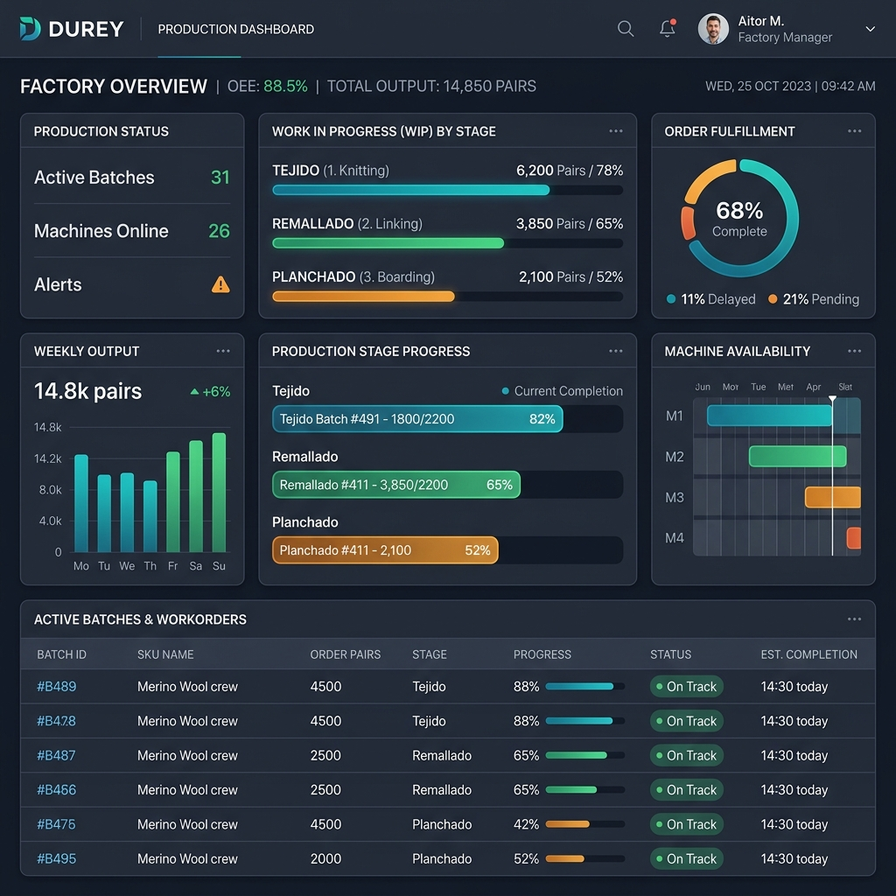
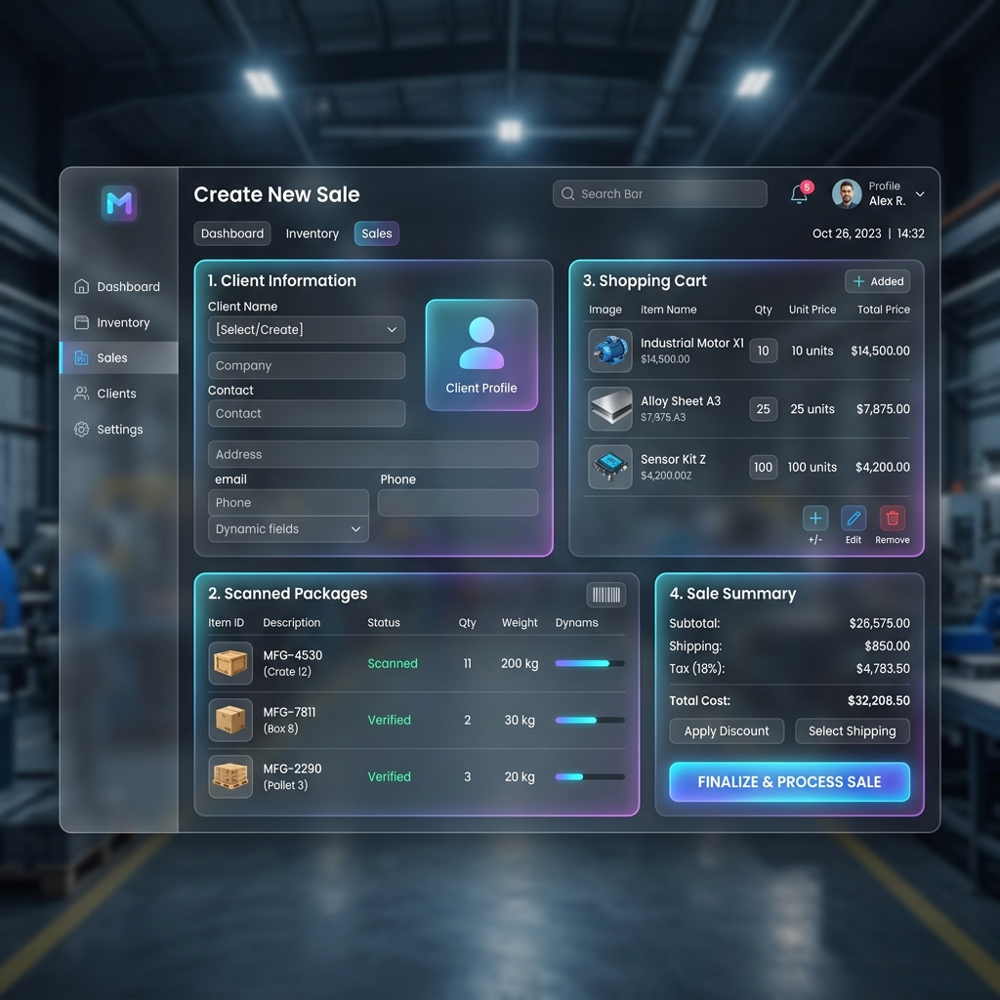

---
pdf_options:
  format: Letter
  margin:
    top: 25mm
    bottom: 25mm
    left: 20mm
    right: 20mm
  printBackground: true
  displayHeaderFooter: true
  headerTemplate: |
    

      MANUAL DE USUARIO - SISTEMA DUREY
      Fábrica de Medias Durey
    

  footerTemplate: |
    

      Página  de 
    

stylesheet: |
  body {
    font-family: 'Helvetica Neue', Helvetica, Arial, sans-serif;
    color: #1e293b;
    line-height: 1.6;
    font-size: 11pt;
  }
  .title-page {
    text-align: center;
    padding-top: 50px;
    page-break-after: always;
  }
  .title-page h1 {
    font-size: 32pt;
    color: #4f46e5;
    margin-bottom: 10px;
  }
  .title-page h2 {
    font-size: 18pt;
    color: #64748b;
    font-weight: 300;
    margin-bottom: 50px;
  }
  .title-page .meta {
    margin-top: 100px;
    font-size: 10pt;
    color: #94a3b8;
  }
  h1 {
    color: #4f46e5;
    font-size: 20pt;
    border-bottom: 2px solid #e2e8f0;
    padding-bottom: 6px;
    margin-top: 35px;
    page-break-before: always;
  }
  h1:first-of-type {
    page-break-before: avoid;
    margin-top: 0;
  }
  h2 {
    color: #2563eb;
    font-size: 14pt;
    margin-top: 25px;
    border-bottom: 1px solid #f1f5f9;
    padding-bottom: 4px;
  }
  h3 {
    color: #0f172a;
    font-size: 11pt;
    margin-top: 18px;
    font-weight: bold;
  }
  p {
    margin-bottom: 12px;
  }
  ol, ul {
    margin-bottom: 15px;
    padding-left: 20px;
  }
  li {
    margin-bottom: 6px;
  }
  .info-box {
    background-color: #eff6ff;
    border-left: 4px solid #3b82f6;
    padding: 12px 16px;
    border-radius: 8px;
    margin: 20px 0;
    font-size: 10pt;
  }
  .warning-box {
    background-color: #fffbeb;
    border-left: 4px solid #f59e0b;
    padding: 12px 16px;
    border-radius: 8px;
    margin: 20px 0;
    font-size: 10pt;
  }
  .success-box {
    background-color: #f0fdf4;
    border-left: 4px solid #22c55e;
    padding: 12px 16px;
    border-radius: 8px;
    margin: 20px 0;
    font-size: 10pt;
  }
  table {
    width: 100%;
    border-collapse: collapse;
    margin: 20px 0;
    font-size: 10pt;
  }
  th, td {
    border: 1px solid #e2e8f0;
    padding: 8px 12px;
    text-align: left;
  }
  th {
    background-color: #f1f5f9;
    font-weight: bold;
    color: #334155;
  }
  img {
    max-width: 85%;
    height: auto;
    border-radius: 12px;
    box-shadow: 0 4px 16px rgba(0, 0, 0, 0.12);
    margin: 20px auto;
    display: block;
  }
  .badge {
    display: inline-block;
    padding: 2px 8px;
    border-radius: 12px;
    font-size: 8pt;
    font-weight: bold;
    text-transform: uppercase;
  }
  .badge-admin { background-color: #f3e8ff; color: #7e22ce; }
  .badge-super { background-color: #e0e7ff; color: #4338ca; }
  .badge-oper { background-color: #ffedd5; color: #c2410c; }
  .badge-vend { background-color: #fce7f3; color: #be185d; }
  .badge-tecn { background-color: #fef3c7; color: #b45309; }
---

     
  <h1>MANUAL DE USUARIO</h1>
  <h2>Sistema de Control de Producción y Ventas DUREY</h2>
    
  
Un manual sencillo y didáctico para configurar y operar tu fábrica de medias de manera digital.

      
  

    
<strong>Fábrica de Medias Durey S.A.</strong>

    
Versión del Sistema: 2.1 • Documento de Usuario Final

    
Año 2026

  

# Introducción al Sistema DUREY

El **Sistema de Control DUREY** es una herramienta digital diseñada para supervisar todo el ciclo de fabricación y comercialización de medias en tu planta. El sistema conecta los departamentos de **Tejido, Remallado, Planchado, Empaque, Almacén y Ventas** en una sola plataforma en tiempo real.

### El Flujo de Trabajo en la Fábrica
El sistema sigue la secuencia lógica de producción de la fábrica de forma automatizada:

1. **Tejido**: Se planifican los turnos y se tejen las medias base, las cuales se acumulan en **Minidepósitos**.
2. **Remallado (Enlace)**: Se toman docenas de los minidepósitos y se remalla la punta de las medias. Al completarse, pasan directo al **Stock Listo para Planchar**.
3. **Planchado**: Se procesa el stock y se detectan prendas defectuosas, enviando el producto limpio a empaque.
4. **Preparado (Empaque)**: Las medias se agrupan en docenas y se rotulan con **Códigos de Barras** (`PKG-XXXX`), ingresando formalmente como inventario en el **Almacén**.
5. **Ventas y Despacho**: Se venden los paquetes terminados y se facturan mediante cobros en caja.

---

# Capítulo 1: Primeros Pasos y Configuración Inicial

Antes de que los trabajadores registren producción, el **Administrador** debe configurar los datos iniciales o "Tablas Maestras".

  <strong>Paso Clave:</strong> Para configurar el sistema debes iniciar sesión con un usuario con el rol de <strong>Administrador General</strong>.

## 1. Inicio de Sesión
Para acceder al sistema:
1. Abre tu navegador e ingresa a la dirección web provista.
2. Coloca tu correo electrónico (ej: `admin@durey.com`) y tu contraseña en la pantalla de bienvenida.
3. Haz clic en **Sign In**.

## 2. Registrar al Personal (Usuarios)
Para dar de alta a tus empleados y asignarles permisos:
1. Ve al menú **Personal** en la barra lateral izquierda.
2. Haz clic en el botón **Agregar Usuario** (o botón "+" de registro).
3. Rellena los datos básicos: Nombre completo, correo electrónico y selecciona el **Rol**:

| Rol | Función en el Sistema | Permisos |
| :--- | :--- | :--- |
| Administrador | Dueño o Gerente general | Acceso total a reportes, auditorías, compras y personal. |
| Supervisor | Encargado de planta | Crea los turnos, asigna los lotes a los operadores and revisa el stock. |
| Operador | Trabajadores de las máquinas | Registran su producción diaria desde su estación. |
| Vendedora | Área comercial | Registra ventas, clientes, cobros de dinero y guías de entrega. |
| Técnico | Soporte de maquinaria | Revisa y soluciona averías reportadas por los operadores. |

4. Marca la casilla **Activo** y haz clic en **Guardar**.

## 3. Registrar las Máquinas
Para llevar el control del estado y mantenimiento de los equipos:
1. Ve a **Máquinas** en el menú.
2. Primero registra las marcas de tus equipos en **Marcas** (ej: Lonati, Sangiacomo).
3. Luego haz clic en **Agregar Máquina**:
   * Escribe el **Código** identificador (ej: `TEJ-01` para tejedora 1, `REM-01` para remalladora 1).
   * Selecciona el **Tipo** (Tejedora o Remalladora).
   * Asigna la marca correspondiente.
4. Al crearse, la máquina quedará en estado Activa lista para trabajar.

## 4. Configurar el Catálogo de Medias
El catálogo contiene los tipos de medias que fabrica Durey y define sus precios de venta.
1. Ve al menú **Catálogo**.
2. Haz clic en **Agregar Media** e ingresa la descripción del producto:
   * **Modelo**: Ej: Tobillera, Escolar, Vestir.
   * **Público**: Ej: Niño, Caballero, Dama, Bebé.
   * **Diseño / Color**: Ej: Blanco Liso, Rayas Rojas, Rombos.
   * **Talla**: Ej: S, M, L o Única.
   * **Precio de Venta**: Costo en Soles por docena (ej: `25.50`).
3. Haz clic en **Guardar**. El sistema autogenerará un **SKU** y un código único para que sea fácil identificar este producto en el almacén y en las ventas.

---

# Capítulo 2: El Ciclo Diario de Producción

Una vez configurado el Personal, las Máquinas y el Catálogo, la planta puede iniciar sus actividades diarias. El supervisor cuenta con una visión general en el **Factory Dashboard**:

## Etapa 1: Tejido (Producción Inicial)
1. **Supervisor**: Entra al módulo **Tejido**, va a "Planificar Turno" y crea un nuevo turno de trabajo. Asigna qué operador tejerá en qué máquina y en qué horario.
2. **Tejedor (Operador)**:
   * Inicia sesión en su dispositivo. El sistema le mostrará el lote y máquina que tiene asignados.
   * Presiona **Iniciar Carga de Lote** al empezar a tejer.
   * Al finalizar su jornada, ingresa las docenas tejidas reales en la pantalla y presiona **Cerrar Turno / Enviar Producción**.
3. **Resultado**: Las docenas tejidas se suman automáticamente al inventario de **Minidepósitos** del modelo correspondiente. El operador y la máquina vuelven a figurar libres ("Disponible" y "Activa").

## Etapa 2: Remallado (Cierre de Lote Atómico)
En esta etapa se cierran las costuras de las medias tejidas.
1. **Supervisor**: Crea un lote de remallado asignando una cantidad de docenas desde los **Minidepósitos** a una operadora en una máquina remalladora específica.
2. **Remalladora (Operador)**:
   * Abre su pantalla de Remallado y presiona **Iniciar Lote**.
   * Al terminar el remallado físico, ingresa:
     * **Docenas Remalladas**: Cantidad total procesada exitosamente.
     * **Docenas Restantes**: Si quedó material pendiente para el próximo turno.
   * Presiona **Registrar Producción / Finalizar Lote**.
3. **Resultado**: El sistema realiza una transacción atómica segura. El lote se cierra, la máquina y operadora quedan libres para el siguiente turno, y el stock de docenas avanza de forma inmediata a la lista de **Stock Listo para Planchar**.

  <strong>Garantía Transaccional:</strong> El cierre de lote de remallado se ejecuta en un solo paso en la base de datos. Si el guardado falla por algún corte de luz o red, no se guardará nada a medias y los operadores nunca quedarán "atascados" en estado ocupado.

## Etapa 3: Planchado
Las medias remalladas deben ser planchadas para darles su forma final y realizar el control de calidad preliminar.
1. **Planchador (Operador)**:
   * En su pantalla de Planchado, selecciona el modelo de media en el que va a trabajar. El sistema le mostrará el stock de docenas disponible acumulado en la etapa anterior.
   * Al terminar la labor, registra:
     * **Docenas Planchadas**: La cantidad total procesada.
     * **Docenas Defectuosas**: La cantidad de medias que salieron rotas, manchadas o con fallas.
   * Presiona **Guardar Reporte**.
2. **Resultado**: El stock listo para planchar se reduce y la producción apta (planchada menos defectuosa) pasa al estado "Listo para Empaque".

## Etapa 4: Preparado (Empaque y Almacenamiento)
Aquí se empaqueta el producto final para su posterior venta.
1. **Preparador (Operador)**:
   * Ingresa a **Preparado** y selecciona las docenas listas.
   * Agrupa las unidades en paquetes de **1 docena** (12 pares).
   * Registra el empaque en el sistema.
2. **Resultado**: El sistema genera un **Código de Paquete** correlativo (ej: `PKG-0024`) y su respectivo código de barras. Las medias ingresan de forma oficial al **Almacén** listas para la venta.

---

# Capítulo 3: Ventas, Caja y Entrega

Este capítulo explica cómo el departamento de **Ventas** (Vendedora) comercializa el producto terminado en Almacén.

## 1. Crear una Venta
1. Ve al menú **Ventas** y haz clic en **Nueva Venta**.
2. **Seleccionar Cliente**: Selecciona un cliente registrado o escribe el nombre y DNI/RUC de uno nuevo para guardarlo en la agenda.
3. **Añadir Productos**: 
   * Selecciona las docenas de medias que el cliente está comprando.
   * Si cuentas con una lectora de códigos de barras, puedes escanear directamente la etiqueta del paquete físico (`PKG-XXXX`) para cargarlo al carrito automáticamente.
4. **Condiciones de Pago**: 
   * **Contado**: El cliente cancela la totalidad en el momento.
   * **Crédito Diferido**: El cliente pagará en una fecha posterior o en cuotas. Define la fecha de vencimiento y el monto.
5. Haz clic en **Confirmar Venta**.

## 2. Apertura de Caja y Registro de Cobros
Toda entrada de dinero por ventas o cuotas debe registrarse en la caja del día.
1. Al empezar el día, ve a **Caja** y haz clic en **Aperturar Caja** ingresando el monto de dinero base con el que inicia (dinero en efectivo para vuelto).
2. Para cobrar una cuota de una venta al crédito:
   * Busca la venta en la sección de Ventas.
   * Haz clic en **Registrar Cobro**.
   * Ingresa el monto pagado por el cliente y selecciona el **Método de Pago** (Efectivo, Yape, Plin o Transferencia Bancaria).
3. Al terminar el día, haz clic en **Cerrar Caja** para ver el balance de ingresos y cuadrar las cuentas.

## 3. Despacho y Guías de Remisión
Para formalizar la salida física de mercadería de la fábrica:
1. Ve al menú **Despacho**.
2. Selecciona la venta que deseas entregar.
3. Haz clic en **Generar Guía de Remisión**:
   * Selecciona el transportista y la dirección de entrega.
4. Imprime la guía para adjuntarla al paquete físico.
5. Marca la entrega como **Entregado** en el sistema cuando la mercadería salga de planta.

---

# Capítulo 4: Gestión de Incidencias (Averías)

Si una máquina presenta fallas durante el trabajo, el sistema cuenta con un flujo de alerta y reparación:

1. **Reportar la Falla**:
   * Si una máquina se traba o malogra en el turno de tejido o remallado, el operador o supervisor va a la sección de **Máquinas** o **Mantenimiento**.
   * Haz clic en **Reportar Avería** en la máquina dañada.
   * Describe brevemente el problema (ej: "Aguja rota en cilindro 3").
2. **Bloqueo Automático**:
   * Al instante, la máquina cambia su estado a **`mantenimiento`** en el sistema.
   * El sistema bloqueará esta máquina y **no permitirá** que ningún supervisor la asigne a nuevos turnos de producción hasta que sea reparada.
3. **Trabajo del Técnico**:
   * El técnico entra al sistema en su módulo de Mantenimiento y verá las alertas de averías activas.
   * Al reparar la máquina, hace clic en **Registrar Reparación**:
     * Describe el trabajo realizado.
     * Registra los repuestos del almacén utilizados.
   * Haz clic en **Completar Reparación**.
4. **Resultado**: La máquina vuelve a cambiar automáticamente a estado **`activa`** y queda disponible inmediatamente en el panel del supervisor para el siguiente turno de trabajo.
